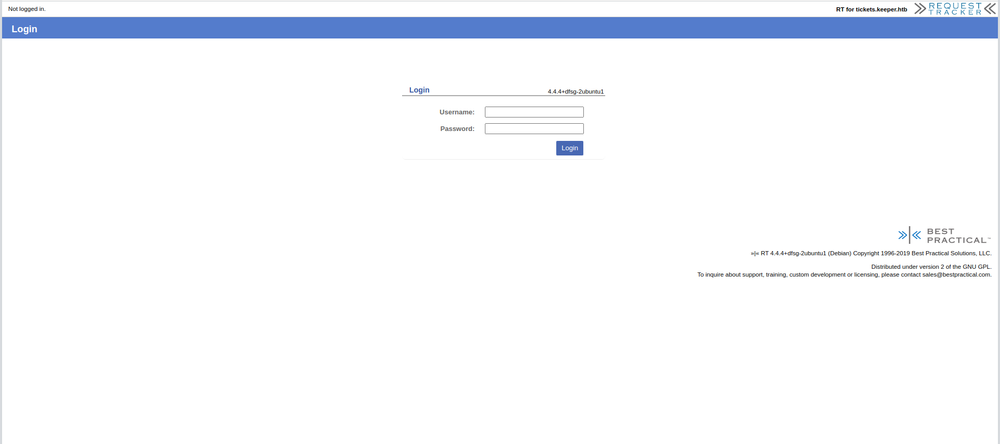

# Keeper machine on [hackthebox](https://app.hackthebox.com)


## Enumeration


nmap Result:
```
sudo nmap -sC -sV -O -T4 10.10.11.227
[sudo] password for kali: 
Starting Nmap 7.94 ( https://nmap.org ) at 2023-09-11 03:04 EDT
Nmap scan report for tickets.keeper.htb (10.10.11.227)
Host is up (0.14s latency).
Not shown: 998 closed tcp ports (reset)
PORT   STATE SERVICE VERSION
22/tcp open  ssh     OpenSSH 8.9p1 Ubuntu 3ubuntu0.3 (Ubuntu Linux; protocol 2.0)
| ssh-hostkey: 
|   256 35:39:d4:39:40:4b:1f:61:86:dd:7c:37:bb:4b:98:9e (ECDSA)
|_  256 1a:e9:72:be:8b:b1:05:d5:ef:fe:dd:80:d8:ef:c0:66 (ED25519)
80/tcp open  http    nginx 1.18.0 (Ubuntu)
|_http-title: Login
|_http-server-header: nginx/1.18.0 (Ubuntu)
|_http-trane-info: Problem with XML parsing of /evox/about
No exact OS matches for host (If you know what OS is running on it, see https://nmap.org/submit/ ).
TCP/IP fingerprint:
OS:SCAN(V=7.94%E=4%D=9/11%OT=22%CT=1%CU=33297%PV=Y%DS=2%DC=I%G=Y%TM=64FEBC0
OS:C%P=x86_64-pc-linux-gnu)SEQ(SP=105%GCD=1%ISR=107%TI=Z%CI=Z%II=I%TS=A)SEQ
OS:(SP=105%GCD=1%ISR=109%TI=Z%CI=Z%II=I%TS=A)SEQ(SP=105%GCD=2%ISR=109%TI=Z%
OS:CI=Z%TS=A)OPS(O1=M53CST11NW7%O2=M53CST11NW7%O3=M53CNNT11NW7%O4=M53CST11N
OS:W7%O5=M53CST11NW7%O6=M53CST11)WIN(W1=FE88%W2=FE88%W3=FE88%W4=FE88%W5=FE8
OS:8%W6=FE88)ECN(R=Y%DF=Y%T=40%W=FAF0%O=M53CNNSNW7%CC=Y%Q=)T1(R=Y%DF=Y%T=40
OS:%S=O%A=S+%F=AS%RD=0%Q=)T2(R=N)T3(R=N)T4(R=Y%DF=Y%T=40%W=0%S=A%A=Z%F=R%O=
OS:%RD=0%Q=)T5(R=Y%DF=Y%T=40%W=0%S=Z%A=S+%F=AR%O=%RD=0%Q=)T6(R=Y%DF=Y%T=40%
OS:W=0%S=A%A=Z%F=R%O=%RD=0%Q=)T7(R=Y%DF=Y%T=40%W=0%S=Z%A=S+%F=AR%O=%RD=0%Q=
OS:)U1(R=Y%DF=N%T=40%IPL=164%UN=0%RIPL=G%RID=G%RIPCK=G%RUCK=G%RUD=G)IE(R=Y%
OS:DFI=N%T=40%CD=S)

Network Distance: 2 hops
Service Info: OS: Linux; CPE: cpe:/o:linux:linux_kernel

OS and Service detection performed. Please report any incorrect results at https://nmap.org/submit/ .
Nmap done: 1 IP address (1 host up) scanned in 29.43 seconds
```

We have port 80 for http and port 22 for ssh open, let's go to the website and check it.


So it wants to redirect us to a website used to raise IT support tickets, let's go and see....

Important note:
```
in order for this website to be availabe you have to add it in the hosts file --> /etc/hosts as the following:
'ip address'    tickets.keeper.htb


we do this so the machine can know what is the ip address of the host we are connecting to which is tickets.keeper.htb
```



We have a login page, firstly let's keep everything simple and just try a couple of default password, maybe we can find a misconfiguration.

Default usernames:
```
admin
root
username
user
```
Default passwords:
```
admin
root
password
passw0rd
```
## Exploitation


Let's try a combination of these.....


And that was fairly easier than expected, root and password, now let's navigate through it and see what can we find.


We found a place for the list of the users, lets go into the first user profile and see what can we find.


In his profile we can see that he's a new user and has an initial password, maybe he didn't change it? let's try it via ssh....


And wow that was way easier than the usual here's the user flag, now let's see if root is as easy....


Here we can see two interesting files, the "passcodes.kdbx" and the "KeePassDumpFull.dmp", lets read about them.

So .dmp files are memory dump files of a certain program, which means it has logs, data and everything about the usage of that program 
and as we read its a dump from keePass which is a local password manager.

For the second file we can find it's a keePass file which we need to use KeePass2 to open it and read the data in it.


So lets get the two files to our local machine and see what can we do....


using python module "http.server" on our target machine and wget on our local machine we got the files, now lets install and open KeePass to see the file which is probably protected by a master password...


As expected... let's see the internet and see if we can get this password somehow using the dump file we have.


We can do such a thing on the version of kdbx file we have so let's use that tool

Link to the python tool on github: [keepass-dumper](https://github.com/CMEPW/keepass-dump-masterkey)

Let's get it and use it on our dump file.

The tool works by analyzing the history in the .dmp file to get possible passwords and here we have a result:


So we have some ambiguous characters, let's google this word to see if it's a known thing...


Let's check that....


So its called "rødgrød med fløde" and its a danish dessert, could this be the password?? let's try....


And it is!!
we can see the root is available as a username with his password so let's get it...

And here is the password we copied: "F4><3K0nd!"

But if we tried to log in via ssh like so:
```
ssh root@10.10.11.227
```

using this password will give us permission denied, so this is not the password apparently, it was changed but not in the password manager file....

We can see that the root entry has a PuTTY user key file


Le'ts search about PuTTY and see what is it....


So this tool can be used to generate ssh keys!
This can be really useful for us since we kinda have something related to the root's private key.

Upon further searching on PuTTY and how to use it, we see that what we have is file generated that has the private and the public key, this file is then used to export the public key, so let's do it.

First let's put the content of the file in a text.


Let's save it and use puttycommand line tool to export the private key.

Install puttygen using:
```
sudo apt install putty-tools
```


IMPORTANT NOTE: i recommend you this article for a quick guide using putty --> [Link.](https://www.ssh.com/academy/ssh/putty/linux/puttygen)

We saved the info of the file in a file called "userkey", let's now export the private key.


```
puttygen userkey -O private-openssh -o finalkey

userkey: the name of the file that was generated and we copied it.

-O: to specify the type of the key which is in our case is private-openssh.

-o: output to file.
```

So now we have a private key file which we can use ssh to connect to the server.


```
ssh -i finalkey root@10.10.11.227

-i: is used to specify the key file that we want to connect with.
```

And we have access finally.


Thanks for reading!

Happy hacking :)
